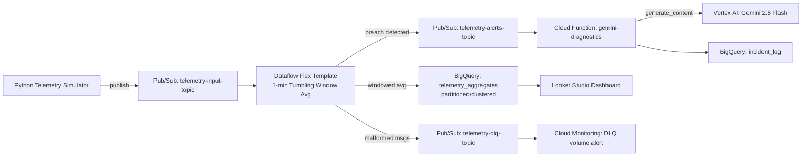

# HLD — Real-Time Machine Telemetry Streaming Pipeline (GCP)

**Repo:** `gcp-streaming-telemetry-pipeline`
**GCP Project:** `project-streaming-telemetry` (org `gcpcloudhub.in`, folder `gch-IT`)

## 1. Purpose

Continuously ingest machine temperature and vibration telemetry, compute
1-minute tumbling-window averages, persist them for analytics, and trigger
an AI-generated root-cause brief whenever a machine breaches a safety
threshold.

## 2. Architecture

## 3. GCP Services Used

| Layer | Service | Purpose |
|---|---|---|
| Ingestion | Pub/Sub | Buffers high-throughput telemetry; decouples producers from processing |
| Processing | Dataflow (Apache Beam, Flex Template) | Stateful tumbling-window aggregation, DLQ routing |
| Storage | BigQuery (`telemetry_analytics` dataset) | Store for raw aggregates + incident log |
| Intelligence | Vertex AI (Gemini 2.5 Flash, `google-genai` SDK) | Root-cause diagnostics on threshold breach |
| Compute (trigger) | Cloud Functions (2nd gen, Eventarc) | Pub/Sub-triggered glue between Dataflow alert and Gemini |
| Networking | VPC (`telemetry-vpc`) + Subnet + Cloud NAT + internal firewall | Private Dataflow workers, no public IPs |
| IAM | Service Accounts (least privilege) | Dedicated SA per component |
| IaC | Terraform (`terraform/envs/lab`) | All infra provisioned and reproducible |
| Observability | Cloud Monitoring + Logging | Pipeline lag, DLQ volume, alert policies |
| Visualization | Looker Studio | Dashboard on top of BigQuery |

## 4. Data Flow

1. Simulator publishes JSON telemetry (`machine_id`, `temperature`, `vibration`, `timestamp`) to `telemetry-input-topic` at a configurable rate.
2. Dataflow reads `telemetry-input-sub`, parses JSON; malformed payloads are tagged and routed to `telemetry-dlq-topic` instead of failing the pipeline.
3. Valid records are windowed with **1-minute tumbling windows** (`FixedWindows(60)`), averaged per `machine_id` for both metrics, and written to `BigQuery.telemetry_aggregates`.
4. When a window's average breaches `avg_temperature > 80.0` **OR** `avg_vibration > 5.0`, the same pipeline publishes an alert message to `telemetry-alerts-topic`.
5. A 2nd-gen Cloud Function, triggered via Eventarc on `telemetry-alerts-topic`, calls Gemini 2.5 Flash via the `google-genai` SDK (Vertex AI backend), and logs the incident + generated diagnostic to `BigQuery.incident_log`.
6. Cloud Monitoring watches DLQ topic depth and Dataflow system lag; alert policies notify on sustained backlog.

## 5. Non-Functional Requirements

- **Scale:** horizontally scales via Dataflow autoscaling (`--max_num_workers`) and Pub/Sub's inherent throughput.
- **Security:** no public IPs on Dataflow workers; internal firewall scoped to the subnet CIDR only; scoped service accounts (no long-lived keys).
- **Cost control:** BigQuery clustered by `machine_id`; Dataflow Streaming Engine enabled; alert Cloud Function fires only on genuine breaches (not on every raw message).
- **Reliability:** DLQ prevents pipeline halts on bad data; alerting on DLQ growth.
- **Repeatability:** Terraform-provisioned (`terraform/envs/lab`); `deletion_protection = false` on BigQuery tables for fast lab teardown/rebuild.

## 6. Out of Scope (v1)

- Multi-region failover
- Historical backfill / batch reprocessing
- Auth on the simulator (assumed trusted internal source for lab purposes)
- GitHub Actions CI/CD (currently applied manually via local `terraform apply`; to be added)
