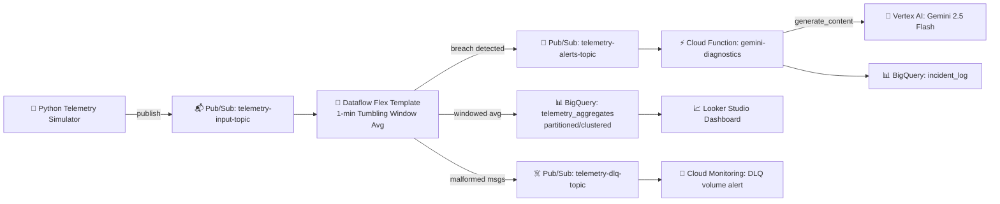

<div align="center">

# 🌡️ HLD — Real-Time Machine Telemetry Streaming Pipeline

**Repo:** `gcp-streaming-telemetry-pipeline` · **Project:** `project-streaming-telemetry` (org `gcpcloudhub.in`, folder `gch-IT`)

</div>

---

## 🎯 1. Purpose

Continuously ingest machine temperature and vibration telemetry, compute
1-minute tumbling-window averages, persist them for analytics, and trigger
an AI-generated root-cause brief whenever a machine breaches a safety
threshold.

## 📁 1a. Repo Structure

```
gcp-streaming-telemetry-pipeline/
├── 📄 README.md
├── 📁 docs/
│   ├── 📄 HLD.md
│   └── 📄 LLD.md
├── 📁 terraform/
│   ├── 📁 envs/lab/
│   │   ├── 📄 main.tf          # networking, pubsub, bigquery, iam
│   │   ├── 📄 cicd.tf          # WIF, Artifact Registry, GCS buckets, required APIs
│   │   ├── 📄 backend.tf       # GCS remote state
│   │   └── 📄 variables.tf
│   └── 📁 modules/              # scaffolded, not yet populated — see LLD §10
│       ├── 📁 pubsub/
│       ├── 📁 bigquery/
│       ├── 📁 networking/
│       ├── 📁 iam/
│       └── 📁 cloud-function/
├── 📁 simulator/
│   └── 📄 publisher.py          # telemetry simulator (temperature + vibration, DLQ test payloads)
├── 📁 dataflow/
│   ├── 📄 pipeline.py            # Beam pipeline (Flex Template source)
│   ├── 📄 test_pipeline.py       # 11 unit tests, Apache Beam TestPipeline
│   ├── 📄 metadata.json          # Flex Template spec
│   ├── 📄 Dockerfile             # template launcher image
│   └── 📄 requirements.txt
├── 📁 cloud-function/
│   └── 📁 gemini-diagnostics/
│       ├── 📄 main.py
│       ├── 📄 conftest.py        # stubs GCP SDKs so tests need no live credentials
│       ├── 📄 test_main.py       # 5 unit tests
│       └── 📄 requirements.txt
└── 📁 .github/
    └── 📁 workflows/
        └── 📄 deploy-pipeline.yml   # validate → test → apply → build → deploy
```

## 🏛️ 2. Architecture



## 🖼️ 2a. Architecture Diagram (presentation / Medium format)

The Mermaid diagram above is the git-native source of truth. The ASCII
version below is for contexts that don't render Mermaid — Medium
articles, README hero images, slide decks.

```
                              [ SIMULATED FACTORY TELEMETRY ]
                                          │
                         (JSON: machine_id, temperature, vibration, timestamp)
                                          │
                                          ▼
┌───────────────────────────────────────────────────────────────────────────────────────────┐
│  📥 INGESTION LAYER          (VPC: telemetry-vpc  /  Subnet: telemetry-subnet)             │
│                                   ┌──────────────────────────┐                             │
│                                   │        Pub/Sub           │                             │
│                                   │   telemetry-input-topic  │                             │
│                                   └────────────┬─────────────┘                             │
└────────────────────────────────────────────────┼───────────────────────────────────────────┘
                                                  ▼
┌───────────────────────────────────────────────────────────────────────────────────────────┐
│  🌊 STREAM PROCESSING LAYER   (Private workers, no public IP  /  Cloud NAT egress)         │
│                          ┌────────────────────────────────────┐                            │
│                          │      Dataflow Flex Template         │                            │
│                          │   (Apache Beam, e2-standard-2)      │                            │
│                          │  1-min tumbling window · avg_temp,  │                            │
│                          │  avg_vibration per machine_id       │                            │
│                          └──────────┬──────────────────┬───────┘                            │
└─────────────────────────────────────┼──────────────────┼─────────────────────────────────────┘
                    (Windowed Averages)│                  │ (Malformed Payload)
                                       ▼                  ▼
┌────────────────────────────────────────┐   ┌───────────────────────────────────────────┐
│  📊 ANALYTICS & STORAGE LAYER           │   │  ☠️ DEAD-LETTER QUEUE                     │
│  BigQuery: telemetry_analytics          │   │  Pub/Sub: telemetry-dlq-topic              │
│   └─ telemetry_aggregates               │   │  (Cloud Monitoring alert on backlog)       │
│      (clustered on machine_id)          │   └───────────────────────────────────────────┘
└────────────────────┬─────────────────────┘
                      │
        (avg_temperature > 80.0°C  OR  avg_vibration > 5.0 mm/s)
                      ▼
┌───────────────────────────────────────────────────────────────────────────────────────────┐
│  🧠 AI & INCIDENT RESPONSE LAYER                                                           │
│  ┌────────────────────┐   ┌───────────────────────┐   ┌──────────────────────────────┐    │
│  │     Pub/Sub          │──►│   Cloud Function       │──►│      Gemini 2.5 Flash        │    │
│  │ telemetry-alerts-    │   │  gemini-diagnostics     │   │   (google-genai SDK,          │    │
│  │      topic           │   │  (gen2, Eventarc,       │   │    Vertex AI backend)         │    │
│  │                       │   │   sa-gemini-function)   │   │  Root-cause diagnostic brief  │    │
│  └────────────────────┘   └───────────────────────┘   └──────────────┬───────────────┘    │
│                                                                        │                     │
│                                                                        ▼                     │
│                                              BigQuery: telemetry_analytics.incident_log      │
└───────────────────────────────────────────────────────────────────────────────────────────┘
```

**Deviations from a generic reference architecture for this problem, and why:**

| Generic reference | This build | Why |
|---|---|---|
| 🌡️ Temperature only | 🌡️📳 Temperature **and** vibration | Vibration is often the earlier warning sign for mechanical (not just thermal) failure |
| 🪟 5-minute sliding window | 🪟 1-minute tumbling window | Simpler Beam state management; deliberate trade-off for lab scale |
| 🎯 Single threshold (temp > 85°C) | 🎯 OR-threshold (temp > 80°C **or** vibration > 5.0 mm/s) | Either signal alone should trigger a look |
| ☠️ DLQ → GCS bucket | ☠️ DLQ → Pub/Sub topic | Easier to reprocess/alert on; consistent with rest of pipeline |
| 📝 Diagnostic printed to a log | 📊 Diagnostic persisted with idempotency key | A log line disappears; a queryable table with dedup doesn't |

## ☁️ 3. GCP Services Used

| Layer | Service | Purpose |
|---|---|---|
| 📥 Ingestion | Pub/Sub | Buffers high-throughput telemetry; decouples producers from processing |
| 🌊 Processing | Dataflow (Apache Beam, Flex Template, `e2-standard-2`) | Stateful tumbling-window aggregation, DLQ routing |
| 📊 Storage | BigQuery (`telemetry_analytics`) | Store for raw aggregates + incident log |
| 🧠 Intelligence | Vertex AI (Gemini 2.5 Flash, `google-genai` SDK) | Root-cause diagnostics on threshold breach |
| ⚡ Compute | Cloud Functions (2nd gen, Eventarc) | Pub/Sub-triggered glue between Dataflow alert and Gemini |
| 🌐 Networking | VPC + Subnet + Cloud NAT + firewall | Private Dataflow workers, no public IPs |
| 📦 Artifacts | Artifact Registry (`telemetry-images`) | Dataflow Flex Template launcher image |
| 🔐 IAM | Service Accounts + Workload Identity Federation | Dedicated SA per component; keyless CI/CD |
| 🏗️ IaC | Terraform, GCS remote state | All infra provisioned and reproducible |
| 🔁 CI/CD | GitHub Actions (`deploy-pipeline.yml`) | Test → validate → apply → build → deploy |
| 🧪 Testing | pytest + Apache Beam `TestPipeline` | 16 unit tests gating every deploy |
| 🔔 Observability | Cloud Monitoring + Logging | Pipeline lag, DLQ volume, alert policies |
| 📈 Visualization | Looker Studio | Public dashboard on top of BigQuery |

## 🔄 4. Data Flow

1. 📡 Simulator publishes JSON telemetry to `telemetry-input-topic`.
2. 🌊 Dataflow parses JSON; malformed payloads → `telemetry-dlq-topic`.
3. 🪟 Valid records windowed (**1-minute tumbling**), averaged per `machine_id`, written to `telemetry_aggregates`.
4. 🚨 On breach (`avg_temperature > 80.0` **OR** `avg_vibration > 5.0`), an alert publishes to `telemetry-alerts-topic`.
5. 🧠 Cloud Function (Eventarc) calls Gemini 2.5 Flash, logs the diagnostic to `incident_log`.
6. 🔔 Cloud Monitoring watches DLQ depth and pipeline lag.
7. 📈 Looker Studio reads both tables for live trend charts + incident feed, with conditional formatting matching the real thresholds.

## 📐 5. Non-Functional Requirements

- ⚖️ **Scale:** Dataflow autoscaling + Pub/Sub throughput.
- 🔐 **Security:** no public IPs (`--disable-public-ips`, org policy); scoped SAs; keyless CI/CD via WIF.
- 💰 **Cost control:** clustered BigQuery table; Streaming Engine; alerts fire only on genuine breaches.
- 🛡️ **Reliability:** DLQ isolation; idempotent CI/CD deploys (fixed job name + conditional `--update`).
- ♻️ **Repeatability:** Terraform-provisioned, GCS remote state shared between local and CI.
- ✅ **Quality gating:** 16 unit tests run in CI before any deploy step executes.

## 🚧 6. Out of Scope (v1)

- 🌍 Multi-region failover (a real regional capacity shortage was hit during testing)
- 📚 Historical backfill / batch reprocessing
- 🔓 Auth on the simulator (assumed trusted internal source)
- 🔐 IAM hardening pass — CI/CD SA currently broader than strictly necessary
