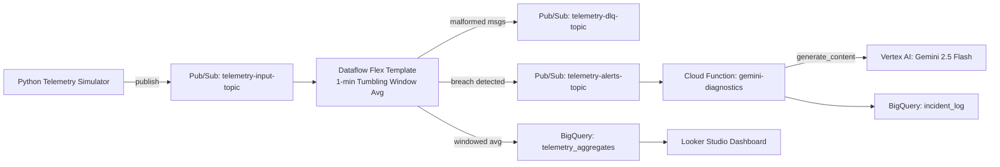

# From Sensor to Diagnosis: A Real-Time GCP Telemetry Pipeline

*Pub/Sub → Dataflow → BigQuery → Gemini 2.5 Flash, plus a dozen real GCP gotchas most tutorials skip*

## 🌟 Introduction

If you've ever deployed a "simple" streaming pipeline to GCP, you know the feeling: the architecture diagram is clean, the Terraform applies without complaint, and everything looks right — right up until the first real deploy, when an org policy silently blocks your Dataflow workers, or a Cloud Build service account that lost its default permissions eighteen months ago quietly breaks your Cloud Function build.

This article builds a real-time GCP streaming pipeline using Cloud Pub/Sub, Cloud Dataflow (Apache Beam), BigQuery, and Gemini 2.5 Flash — a system that watches simulated factory machine telemetry (temperature + vibration), computes rolling 1-minute averages per machine, and the moment a machine crosses a safety threshold, automatically asks Gemini to diagnose the likely root cause and logs it as a permanent incident. Every service below was deployed for real, debugged against real GCP errors, and verified with real breaches producing real Gemini output in BigQuery — not a static demo.

### 🧰 Tech Stack

| Property | Value |
|---|---|
| ☁️ Cloud Platform | Google Cloud Platform |
| 🌊 Stream Processing | Cloud Dataflow, Apache Beam (Flex Template) |
| 📊 Storage | BigQuery (`telemetry_aggregates`, `incident_log`) |
| 🧠 AI Model | Gemini 2.5 Flash via Vertex AI (`google-genai` SDK) |
| 📬 Messaging | Cloud Pub/Sub (ingestion, DLQ, alerts) |
| 🏗️ IaC | Terraform, GCS remote state |
| 🔁 CI/CD | GitHub Actions, Workload Identity Federation (keyless) |
| 🧪 Test Suite | 16 unit tests (Beam `TestPipeline` + pytest), gating every deploy |
| 📈 Dashboard | Looker Studio, publicly embeddable |
| 🐍 Language | Python 3.12 |

## 🏭 The Problem, In Plain Terms

Picture a factory floor. Rows of machines running around the clock — motors, compressors, pumps, whatever the plant makes its living from. Each one has a temperature sensor and a vibration sensor bolted on, quietly reporting numbers every couple of seconds.

Two things go wrong with machines like this, and they both give you a warning if you're listening:

- 🌡️ **They get hot before they fail.** Rising temperature usually means friction, a cooling problem, or a part working harder than it should.
- 📳 **They shake before they break.** Rising vibration usually means a bearing wearing out, something coming loose, or parts drifting out of alignment.

The problem in most plants isn't a lack of sensors — it's that nobody's watching the numbers *continuously*, and even when someone is, "average temperature over the last minute is a bit high" doesn't tell a technician *what to actually go check*. You want two things: something that never gets tired of watching a screen, and something that turns "80.57°C" into "this looks like impaired heat dissipation — inspect cooling first."

**In plain terms, here's the relay race the data runs:**

1. **Sensors → mailroom.** Every machine's readings get dropped into a queue (Pub/Sub) as fast as they're produced. Nothing gets lost even if the next step is momentarily busy.
2. **Mailroom → calculator.** A continuously-running calculator (Dataflow) picks up every message, throws out anything malformed, and keeps a running 1-minute average per machine for both temperature and vibration.
3. **Calculator → permanent record book.** Every minute's average gets written to a database (BigQuery) — the full history, queryable anytime.
4. **Calculator → alarm bell.** If a machine's average temperature goes over 80°C, *or* its vibration goes over 5.0 mm/s, an alert fires immediately.
5. **Alarm bell → smart assistant.** A cloud function catches that alert and asks Gemini 2.5 Flash: *given these numbers, what's the likely mechanical issue, and what should a technician check first?* The answer gets logged as an incident, permanently, alongside the numbers that triggered it.

No human has to be staring at a dashboard for this to work — the system watches, decides, and explains itself.

## 🏛️ Architecture



*Press enter or click to view image in full size*

Here's the same architecture in the layered, boxed style:

```
                              [ SIMULATED FACTORY TELEMETRY ]
                                          │
                         (JSON: machine_id, temperature, vibration, timestamp)
                                          │
                                          ▼
┌───────────────────────────────────────────────────────────────────────────────────────────┐
│  INGESTION LAYER            (VPC: telemetry-vpc  /  Subnet: telemetry-subnet)              │
│                                   ┌──────────────────────────┐                             │
│                                   │        Pub/Sub           │                             │
│                                   │   telemetry-input-topic  │                             │
│                                   └────────────┬─────────────┘                             │
└────────────────────────────────────────────────┼───────────────────────────────────────────┘
                                                  │
                                                  ▼
┌───────────────────────────────────────────────────────────────────────────────────────────┐
│  STREAM PROCESSING LAYER      (Private workers, no public IP  /  Cloud NAT egress)         │
│                          ┌────────────────────────────────────┐                            │
│                          │      Dataflow Flex Template         │                            │
│                          │   (Apache Beam, sa-dataflow-worker) │                            │
│                          │  1-min tumbling window · avg_temp,  │                            │
│                          │  avg_vibration per machine_id       │                            │
│                          └──────────┬──────────────────┬───────┘                            │
└─────────────────────────────────────┼──────────────────┼─────────────────────────────────────┘
                    (Windowed Averages)│                  │ (Malformed Payload)
                                       ▼                  ▼
┌────────────────────────────────────────┐   ┌───────────────────────────────────────────┐
│  ANALYTICS & STORAGE LAYER              │   │  DEAD-LETTER QUEUE                        │
│  BigQuery: telemetry_analytics          │   │  Pub/Sub: telemetry-dlq-topic              │
│   └─ telemetry_aggregates               │   │  (Cloud Monitoring alert on backlog)       │
│      (clustered on machine_id)          │   └───────────────────────────────────────────┘
└────────────────────┬─────────────────────┘
                      │
        (avg_temperature > 80.0°C  OR  avg_vibration > 5.0 mm/s)
                      ▼
┌───────────────────────────────────────────────────────────────────────────────────────────┐
│  AI & INCIDENT RESPONSE LAYER                                                              │
│  ┌────────────────────┐   ┌───────────────────────┐   ┌──────────────────────────────┐    │
│  │     Pub/Sub          │──►│   Cloud Function       │──►│      Gemini 2.5 Flash        │    │
│  │ telemetry-alerts-    │   │  gemini-diagnostics     │   │   (google-genai SDK,          │    │
│  │      topic           │   │  (gen2, Eventarc,       │   │    Vertex AI backend)         │    │
│  │                       │   │   sa-gemini-function)   │   │  Root-cause diagnostic brief  │    │
│  └────────────────────┘   └───────────────────────┘   └──────────────┬───────────────┘    │
│                                                                        │                     │
│                                                                        ▼                     │
│                                              BigQuery: telemetry_analytics.incident_log      │
└───────────────────────────────────────────────────────────────────────────────────────────┘
```

*Press enter or click to view image in full size*

**A few deliberate departures from the typical reference architecture for this kind of pipeline — and the reasoning behind each:**

| Generic reference architecture | This build | Why |
|---|---|---|
| Temperature only | Temperature **and** vibration | Vibration is often the earlier warning sign for mechanical (not just thermal) failure |
| 5-minute *sliding* window, updated every minute | 1-minute *tumbling* window | Simpler state management in Beam; a deliberate trade-off for a lab-scale system |
| Single threshold (temp > 85°C) | OR-threshold (temp > 80°C **or** vibration > 5.0 mm/s) | Either signal alone should trigger a look |
| Dead-letter queue → GCS bucket | Dead-letter queue → Pub/Sub topic | Easier to reprocess/alert on, consistent with the rest of the pipeline |
| Diagnostic printed to a log | Diagnostic **persisted** to `incident_log` with a deterministic idempotency key | A log line disappears; a queryable table with dedup doesn't |

None of these are corrections to the generic version — they're the kind of decisions you actually make once you're building for a specific use case instead of a general-purpose demo.

### 🔄 Layer Breakdown

| Layer | Components |
|---|---|
| 📥 Ingestion | Pub/Sub topic, decoupling producers from processing |
| 🌊 Stream Processing | Dataflow Flex Template, Apache Beam, 1-min tumbling windows, dual-metric aggregation |
| 📊 Storage | BigQuery, clustered on `machine_id` |
| ☠️ Error Handling | Pub/Sub dead-letter topic for malformed payloads |
| 🧠 Intelligence | Cloud Function (Eventarc) → Gemini 2.5 Flash → persisted incident with idempotency key |
| 📈 Visualization | Looker Studio, live-connected to BigQuery |
| 🔁 Delivery | Terraform + GitHub Actions, Workload Identity Federation, 16-test gate |

## 🧱 What It Does

| Capability | Description |
|---|---|
| 📡 Continuous ingestion | Simulated machine telemetry streamed via Pub/Sub, at configurable rate |
| 🪟 Windowed aggregation | 1-minute tumbling windows, per-machine average temperature and vibration |
| ☠️ Malformed-data isolation | Bad payloads routed to a DLQ instead of crashing the pipeline |
| 🚨 Dual-metric breach detection | `avg_temperature > 80.0` **OR** `avg_vibration > 5.0` |
| 🧠 AI root-cause diagnosis | Gemini 2.5 Flash generates a real operational diagnostic per incident |
| 🔁 Idempotent incident logging | Deterministic hash key prevents duplicate incidents on retried delivery |
| 🏗️ Fully Terraform-managed | Networking, IAM, Pub/Sub, BigQuery, CI/CD infra — all as code |
| 🔐 Keyless CI/CD | Workload Identity Federation — no static service account keys anywhere |
| 🧪 Test-gated deploys | 16 unit tests must pass before any `terraform apply` or live deploy |
| 📈 Public live dashboard | Looker Studio, viewable without a GCP login |

## 🛠️ Under the Hood

The core of the Dataflow job is a straightforward Beam pipeline: parse and validate incoming JSON (routing anything malformed to a dead-letter topic instead of crashing the pipeline), window into 1-minute tumbling windows, compute per-machine averages for both temperature and vibration, write to BigQuery, and fork a second branch that checks each windowed average against a threshold:

```python
class FilterAndFormatAlertsFn(beam.DoFn):
    def process(self, element):
        avg_temp = element['avg_temperature']
        avg_vib = element['avg_vibration']
        if avg_temp > 80.0 or avg_vib > 5.0:
            alert_payload = {
                'machine_id': element['machine_id'],
                'avg_temperature': avg_temp,
                'avg_vibration': avg_vib,
                'window_end': element['window_end']
            }
            yield beam.pvalue.TaggedOutput(
                self.TAG_ALERT,
                json.dumps(alert_payload).encode('utf-8')
            )
```

One design choice worth calling out: **1-minute tumbling windows, not the 5-minute sliding windows** you'll see in most reference architectures. Sliding windows are more "textbook," but tumbling windows are simpler to reason about and cheaper to compute — a deliberate trade-off for a lab-scale system, not a limitation.

### 🧠 The AI Layer

When a breach fires, a 2nd-gen Cloud Function — triggered via Eventarc on the alert topic — calls Gemini 2.5 Flash with the breach context and asks for a concise operational diagnostic:

```python
response = gemini_client.models.generate_content(
    model="gemini-2.5-flash",
    contents=prompt
)
```

The result gets written to a BigQuery `incident_log` table alongside a deterministic idempotency key (a hash of `machine_id` + `window_end`), so a retried Eventarc delivery doesn't create a duplicate incident.

Here's a real one, generated from an actual detected breach during testing — not a hand-crafted example:

> *"Elevated vibration exceeding its threshold (5.19 mm/s) strongly indicates a developing mechanical fault on MCH-PLANT-01-002, such as imbalance, misalignment, or bearing degradation. Immediately initiate a physical inspection for loose components, unusual noises, or visible damage..."*

That's the part that made this project worth building — not just moving data through a pipeline, but having the system reason about what the data means.

## ⚠️ Real Deployment Gotchas (Found & Fixed)

Most tutorials skip this part. This project didn't. Every one of these was a real failure against live GCP, not a hypothetical:

**1. Org policy silently blocked Dataflow workers.**
GCP org policy blocks external IPs on Compute Engine VMs by default. Dataflow's launcher VM requests one unless you pass `--disable-public-ips` — without it, the job dies in ~1 second with no useful error, only findable by digging into Cloud Logging.

**2. Cloud Build's default service account lost its auto-granted permissions.**
Newer GCP projects no longer auto-grant `Editor` to the Cloud Build service account, silently breaking every Cloud Functions gen2 deploy. Two different service accounts can be the actual builder depending on project age — granting the wrong one repeats the same error.

**3. Artifact Registry read access for the Dataflow launcher.**
The launcher VM needs `artifactregistry.reader` to pull its own container image. Without it, it boots fine, then fails four `docker pull` retries and gives up.

**4. Eventarc can authenticate but still can't invoke.**
A gen2 Cloud Function triggered by Pub/Sub is a Cloud Run service underneath. Eventarc's service account needs `roles/run.invoker` on that Cloud Run service specifically — a separate grant most people don't think to set up front.

**5. Zone-level resource exhaustion.**
`ZONE_RESOURCE_POOL_EXHAUSTED` — a real, temporary Compute Engine capacity shortage, not a bug. Fixed by switching the worker machine type to `e2-standard-2`, a different capacity pool.

**6. PowerShell's backtick escaping ate part of a query — twice.**
`` `t `` in a PowerShell here-string is a tab character, not a literal backtick-t — it silently corrupted a BigQuery table reference. Fixed with single-quoted (`@'...'@`) here-strings, which skip escape processing entirely.

**7. Toolchain version drift.**
Local Python 3.14 was too new for Apache Beam's prebuilt wheels, so `grpcio-tools` tried building from source and failed. The fix was trusting CI's pinned Python 3.12 runner instead of fighting the local environment.

None of these are exotic. Any one of them will cost you an afternoon if you hit it cold. Together, they're the actual content of "deploying to GCP" that a clean architecture diagram never shows.

## 🧪 Testing

Beyond manual end-to-end verification (slow, and it costs real GCP resources every time), the repo has a proper unit test layer:

- **11 tests** on the Beam pipeline logic — parsing/DLQ routing, the averaging math, and the OR-threshold breach logic, including an explicit boundary test pinning that exactly 80.0°C is *not* a breach (strict `>`, not `>=`)
- **5 tests** on the Cloud Function — successful incident logging, idempotency-key stability across retried deliveries, malformed-payload handling, and graceful (non-crashing) handling of a BigQuery insert error

Both suites run in under 4 seconds combined and gate every CI deploy — a broken pipeline or function never reaches `terraform apply`, let alone a live GCP resource.

## 🔁 CI/CD

GitHub Actions, authenticated via Workload Identity Federation — no static service account keys anywhere in the repo or its secrets. The pipeline: validate Terraform → run unit tests → apply infrastructure → build the Dataflow Flex Template and Docker image → deploy the Cloud Function → launch or update the Dataflow job idempotently (a fixed job name plus a conditional `--update` flag, so redeploys update the running pipeline in place instead of spinning up a duplicate job that splits Pub/Sub consumption).

## 🎯 What a Real Run Looks Like

```
#1  python simulator/publisher.py
    → publishing telemetry for MCH-PLANT-01-001, MCH-PLANT-01-002,
      MCH-PLANT-02-005 every 2 seconds, ~5% malformed test payloads

#2  gcloud dataflow jobs list --region=us-central1 --status=active
    → JOB_STATE_RUNNING, telemetry-pipeline-lab, us-central1-a

#3  SELECT machine_id, avg_temperature, avg_vibration, window_end
    FROM telemetry_analytics.telemetry_aggregates
    ORDER BY calculated_at DESC LIMIT 10
    → real per-machine averages, one row per 1-minute window

#4  A window crosses the threshold naturally — avg_vibration: 5.19
    → Pub/Sub alert → Cloud Function → Gemini 2.5 Flash

#5  SELECT * FROM telemetry_analytics.incident_log
    ORDER BY detected_at DESC LIMIT 5
    → "Elevated vibration exceeding its threshold (5.19 mm/s)
       strongly indicates a developing mechanical fault on
       MCH-PLANT-01-002..."
```

Independently verified across a genuine 10-minute background run, not a single forced test case — 7 distinct real incidents logged, each with its own Gemini-generated diagnostic.

## ✅ Conclusion

✅ Real-time streaming pipeline, Pub/Sub → Dataflow → BigQuery, fully live-tested
✅ Dual-metric (temperature + vibration) breach detection with an OR-threshold, not a single-signal demo
✅ Gemini 2.5 Flash generating genuine root-cause diagnostics on real breaches
✅ Idempotent incident logging — a deterministic key stops duplicate incidents on retry
✅ Fully Terraform-managed, including IAM, networking, and CI/CD infrastructure itself
✅ 16-test-gated GitHub Actions pipeline, keyless via Workload Identity Federation


The actual lesson: a Terraform config that applies cleanly once is not the same as a pipeline that survives contact with a real GCP org's policies, IAM defaults, and regional capacity. The gap between the two only closes when you run the thing — repeatedly, against something real, and watch what actually breaks.

## 🚀 What's Next

- A production hardening pass on IAM (the CI service account currently holds broader permissions than strictly necessary, a deliberate trade-off for build velocity during this project)
- Multi-region resilience, given the zone-capacity issue above
- Historical trend analysis via BigQuery ML

## 📸 Snapshots

Real, live provisioning through the deployed pipeline — simulator to Terraform apply, live verification, and the dashboard build walkthrough. Every screenshot below is from an actual run, not simulated.

**CI/CD — GitHub Actions, full green run**


**Live Pipeline Verification — simulator, Dataflow job, BigQuery**


**Looker Studio Dashboard — build walkthrough**


## 🔗 Repository

The full source code, Terraform, CI/CD workflow, and both test suites are at:

**[gcp-streaming-telemetry-pipeline](https://github.com/bikram-singh/gcp-streaming-telemetry-pipeline)** — Real-time telemetry pipeline · Dataflow · BigQuery · Gemini 2.5 Flash · Terraform · Google Cloud Platform
